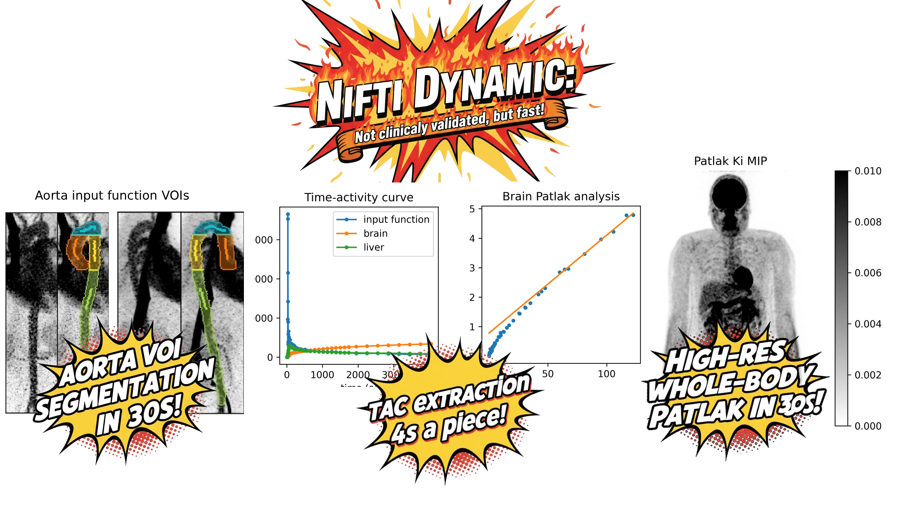

# nifti_dynamic 🧠⚡

Efficient TAC extraction and Patlak analysis of HUGE PET arrays in NIfTI format. Works with gzipped 4D PET images (saving 90% disk space vs DICOM) 📦. All algorithms load partial chunks to prevent memory crashes when handling massive arrays (440×440×645×69×4 bytes = 32GB).

> Implementation based on Andersen TL, et al. *Diagnostics* 2024;14(15):1590. [doi:10.3390/diagnostics14151590](https://doi.org/10.3390/diagnostics14151590)

## Installation 💾

```bash
pip install nifti_dynamic
```

**Important**: Always ensure `indexed_gzip` is installed for significantly faster reading of gzipped NIfTI arrays (.nii.gz) ⚡

## Performance ⏱️

- Automatic extraction of 4 VOIs: 30 seconds
- TAC for single organs: 10 seconds  
- TACs for all 114 TotalSegmentator organs: 10 minutes
- Full voxel Patlak for 440×440×645×69 array: 30 seconds

## CLI Usage 🚀

### Extract Input Function from Aorta

```bash
extract_input_function \
  --pet dpet.nii.gz \
  --totalseg totalseg.nii.gz \
  --output ./results
```

### Extract TACs for All Organs

```bash
extract_tacs \
  --pet dpet.nii.gz \
  --segmentation totalseg.nii.gz \
  --output ./tacs
```

### Voxel-wise Patlak Analysis

```bash
voxel_patlak \
  --pet dpet.nii.gz \
  --input-function input_fun.csv \
  --output ./patlak
```

## Python API Usage

For programmatic access, see [example.py](example.py) for detailed Python API usage.


